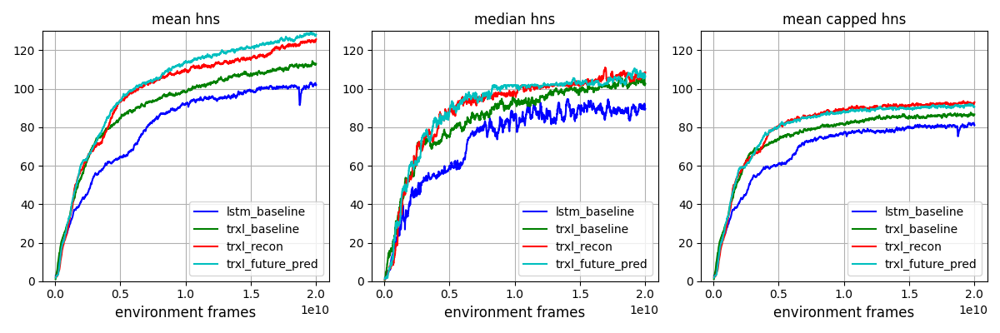

# Brain Agent 


## Overview
We present BrainAgent, a codebase with following features.
  1. First publicly available implementations of SOTA results on [DMLAB30](https://github.com/deepmind/lab) environments
  2. Scalable & massive throughput - BrainAgent can produce and train 20B frames/week, or 34k fps, with 16 V100 GPUs, by scale-up high throughput single node system [Sample Factory](https://github.com/alex-petrenko/sample-factory)
  3. Based on following algorithms and architectures
     * [TransformerXL-I](https://proceedings.mlr.press/v119/parisotto20a.html) core and [ResNet](https://arxiv.org/abs/1512.03385?context=cs) encoder
     * [V-trace](https://arxiv.org/abs/1802.01561) update algorithm
     * [IMPALA](https://arxiv.org/abs/1802.01561) system framework 
     * [PopArt](https://arxiv.org/abs/1809.04474) for multitask handling
  4. For self-supervised representation learning, we include 2 additional features
     * ResNet-based decoder to reconstruct the original input image ([trxl_recon](https://github.com/kakaobrain/brain_agent/blob/main/configs/trxl_recon_train.yaml))
     * additional autoregressive transformer to predict the images of future steps from the current state embedding and future action sequence ([trxl_future_pred](https://github.com/kakaobrain/brain_agent/blob/main/configs/trxl_future_pred_train.yaml))
  5. Provide codes for both training and evaluation, along with SOTA model checkpoint with 28M params


## How to Install
- `Python 3.7`
- `Pytorch 1.9.0`
- `CUDA 11.1`
- Install DMLab envrionment - [DMLab Github](https://github.com/deepmind/lab/blob/master/docs/users/build.md)
- `pip install -r requirements.txt`

## Description of Codes
- `dist_launch.py` -> distributed training launcher
- `eval.py` -> entry point for evaluation 
- `train.py` -> entry point for training 
- `brain_agent`
  - `core`
    - `agents`
      -  `dmlab_multitask_agent.py`
    - `algos`
      - `aux_future_predict.py` -> Computes auxiliary loss by predicting future state transitions with autoregressive transformer. Used only for ([trxl_future_pred](https://github.com/kakaobrain/brain_agent/blob/main/configs/trxl_future_pred_train.yaml))
      - `popart.py` 
      - `vtrace.py`
    - `actor_worker.py` 
    - `learner_worker.py`
    - `policy_worker.py`
    - `shared_buffer.py` -> Defines SharedBuffer class for zero-copy communication between workers
  - `envs`
    - `dmlab`
  - `utils`
    - ...


## How to Run
### Training
- 1 node x 1 GPU 
  ```bash
     python train.py cfg=configs/trxl_recon_train.yaml train_dir=$TRAIN_DIR experiment=$EXPERIMENT_DIR
  ```
  
- 1 node x 4 GPUs = 4 GPUs
  ```bash
     python -m dist_launch --nnodes=1 --node_rank=0 --nproc_per_node=4 --master_addr=$MASTER_ADDR -m train \ 
       cfg=configs/trxl_recon_train.yaml train_dir=$TRAIN_DIR experiment=$EXPERIMENT_DIR
  ```

- 4 nodes x 4 GPUs each = 16 GPUs
  ```bash
     sleep 120; python -m dist_launch --nnodes=4 --node_rank=0 --nproc_per_node=4 --master_addr=$MASTER_ADDR -m train \ 
       cfg=configs/trxl_recon_train.yaml train_dir=$TRAIN_DIR experiment=$EXPERIMENT_DIR 
     sleep 120; python -m dist_launch --nnodes=4 --node_rank=1 --nproc_per_node=4 --master_addr=$MASTER_ADDR -m train \ 
       cfg=configs/trxl_recon_train.yaml train_dir=$TRAIN_DIR experiment=$EXPERIMENT_DIR
     sleep 120; python -m dist_launch --nnodes=4 --node_rank=2 --nproc_per_node=4 --master_addr=$MASTER_ADDR -m train \ 
       cfg=configs/trxl_recon_train.yaml train_dir=$TRAIN_DIR experiment=$EXPERIMENT_DIR
     sleep 120; python -m dist_launch --nnodes=4 --node_rank=3 --nproc_per_node=4 --master_addr=$MASTER_ADDR -m train \ 
       cfg=configs/trxl_recon_train.yaml train_dir=$TRAIN_DIR experiment=$EXPERIMENT_DIR
  ```

### Evaluation
```bash
python eval.py cfg=configs/trxl_recon_eval.yaml train_dir=$TRAIN_DIR experiment=$EXPERIMENT_DIR test.checkpoint=$CHECKPOINT_FILE_PATH 
```


## Results for DMLAB30

- Settings
  - 3 runs with different seeds
  - 100 episodes per each run
  - HNS : Human Normalised Score
- Results
    
    |  Model | Mean HNS  | Median HNS | Mean Capped HNS |
    |:----------:|:--------:|:----------:|:---------------:|
    | [MERLIN](https://arxiv.org/pdf/1803.10760.pdf) | 115.2  | - | 89.4 |
    | [GTrXL](https://proceedings.mlr.press/v119/parisotto20a.html) | 117.6 | - | 89.1 |
    | [CoBERL](https://arxiv.org/pdf/2107.05431.pdf) | 115.47  | 110.86 |- |
    | [R2D2+](https://openreview.net/pdf?id=r1lyTjAqYX) | -  | 99.5 | 85.7 |
    | [LASER](https://arxiv.org/abs/1909.11583) | -  | 97.2 | 81.7 |
    | [PBL](https://arxiv.org/pdf/2004.14646.pdf) | 104.16  | - | 81.5 |
    | [PopArt-IMPALA](https://arxiv.org/abs/1809.04474) | -  | - | 72.8 |
    | [IMPALA](https://arxiv.org/abs/1802.01561) | -  | - | 58.4 |
    |	Ours (lstm_baseline, [20B ckpt](https://arena.kakaocdn.net/brainrepo/models/brain_agent/ed7f0e5a8dc57ad72c8c38319f58000e/rnn_baseline_20b.pth))	|	103.03 ± 0.37	|	92.04 ± 0.73	|	81.35 ± 0.25	|
    |	Ours (trxl_baseline, [20B ckpt](https://arena.kakaocdn.net/brainrepo/models/brain_agent/c0e90a4e3555a12b58e60729d13e2e02/trxl_baseline_20b.pth))	|	111.95 ± 1.00	|	105.43 ± 2.61	|	85.57 ± 0.20	|
    |	Ours (trxl_recon, [20B ckpt](https://arena.kakaocdn.net/brainrepo/models/brain_agent/84ac1c594b8eb95e7fd9879d6172f99b/trxl_recon_20b.pth))	|	123.60 ± 0.84	|	108.63  ± 1.20	|	**91.25 ± 0.41**	|
    |	Ours (trxl_future_pred, [20B ckpt](https://arena.kakaocdn.net/brainrepo/models/brain_agent/a54acdd9d3a14f2905d295c9c63bf31d/trxl_future_pred_20b.pth))	|	**128.00 ± 0.43**	|	108.80  0.99	|	90.53 ± 0.26	|


<details>
<summary>Results for all 30 tasks</summary>
<div markdown="1">
                                                        
    |	Level	|	lstm_baseline	|	&nbsp;trxl_baseline&nbsp;	|	&nbsp;&nbsp;&nbsp;&nbsp;trxl_recon&nbsp;&nbsp;&nbsp;&nbsp;	|	trxl_future_pred	|
    |	:-----:	|	:-----:	|	:-----:	|	:-----:	|	:---:	|
    |	rooms_collect_good_objects_(train / test)	|	94.22 ± 0.84 / 95.13 ± 0.61	|	97.85 ± 0.31 / 95.20 ± 1.26	|	97.58 ± 0.20 / 89.39 ± 1.42	|	98.19 ± 0.18 / 98.52 ± 0.95	|
    |	rooms_exploit_deferred_effects_(train / test)	|	37.84 ± 2.23 / 4.36 ± 1.84	|	38.40 ± 3.82 / 1.73 ± 0.63	|	38.86 ± 3.48 / 4.04 ± 0.89	|	40.93 ± 3.12 / 2.26 ± 0.71	|
    |	rooms_select_nonmatching_object	|	50.13 ± 2.95	|	98.78 ± 1.38	|	99.52 ± 0.97	|	113.20 ± 1.14	|
    |	rooms_watermaze	|	45.09 ± 4.70	|	36.92 ± 6.90	|	111.20 ± 2.29	|	55.82 ± 0.74	|
    |	rooms_keys_doors_puzzle	|	51.75 ± 8.90	|	55.86 ± 4.25	|	61.24 ± 9.09	|	64.95 ± 8.43	|
    |	language_select_described_object	|	150.57 ± 0.58	|	154.90 ± 0.22	|	155.35 ± 0.17	|	158.23 ± 0.90	|
    |	language_select_located_object	|	225.97 ± 1.93	|	244.46 ± 1.56	|	252.04 ± 0.31	|	261.20 ± 1.15	|
    |	language_execute_random_task	|	126.49 ± 2.35	|	139.63 ± 1.23	|	145.21 ± 0.36	|	150.20 ± 1.35	|
    |	language_answer_quantitative_question	|	153.92 ± 2.35	|	162.99 ± 2.42	|	163.72 ± 1.36	|	166.07 ± 1.72	|
    |	lasertag_one_opponent_small	|	234.90 ± 6.19	|	243.52 ± 3.96	|	249.99 ± 6.64	|	279.54 ± 4.14	|
    |	lasertag_three_opponents_small	|	235.61 ± 1.92	|	242.61 ± 3.75	|	246.68 ± 5.99	|	264.20 ± 3.76	|
    |	lasertag_one_opponent_large	|	74.88 ± 5.06	|	83.51 ± 1.31	|	82.55 ± 2.15	|	94.86 ± 3.64	|
    |	lasertag_three_opponents_large	|	84.78 ± 2.42	|	92.04 ± 2.17	|	96.54 ± 0.67	|	105.83 ± 0.47	|
    |	natlab_fixed_large_map	|	98.10 ± 1.77	|	110.74 ± 1.34	|	120.53 ± 1.79	|	118.17 ± 1.79	|
    |	natlab_varying_map_regrowth	|	108.54 ± 1.20	|	107.16 ± 2.68	|	108.14 ± 1.25	|	104.83 ± 1.26	|
    |	natlab_varying_map_randomized	|	85.33 ± 6.52	|	86.33 ± 7.30	|	85.53 ± 6.69	|	77.74 ± 0.84	|
    |	skymaze_irreversible_path_hard	|	55.29 ± 9.08	|	60.63 ± 4.73	|	61.63 ± 2.52	|	66.30 ± 5.69	|
    |	skymaze_irreversible_path_varied	|	77.02 ± 3.57	|	77.41 ± 0.67	|	81.31 ± 2.34	|	79.36 ± 7.95	|
    |	psychlab_arbitrary_visuomotor_mapping	|	52.17 ± 2.06	|	51.46 ± 0.45	|	101.82 ± 0.19	|	101.80 ± 0.00	|
    |	psychlab_continuous_recognition	|	52.57 ± 0.46	|	52.41 ± 0.92	|	102.46 ± 0.32	|	102.30 ± 0.00	|
    |	psychlab_sequential_comparison	|	76.82 ± 0.45	|	75.48 ± 1.16	|	75.74 ± 0.58	|	76.13 ± 0.77	|
    |	psychlab_visual_search	|	101.54 ± 0.10	|	101.58 ± 0.04	|	101.91 ± 0.00	|	101.90 ± 0.00	|
    |	explore_object_locations_small	|	118.89 ± 0.93	|	121.47 ± 0.26	|	123.54 ± 2.61	|	126.67 ± 2.08	|
    |	explore_object_locations_large	|	111.46 ± 2.91	|	120.70 ± 2.12	|	115.43 ± 1.64	|	129.83 ± 2.41	|
    |	explore_obstructed_goals_small	|	136.92 ± 6.02	|	148.05 ± 1.96	|	166.75 ± 3.63	|	174.30 ± 3.72	|
    |	explore_obstructed_goals_large	|	92.36 ± 5.81	|	106.73 ± 7.86	|	153.44 ± 3.20	|	176.43 ± 1.50	|
    |	explore_goal_locations_small	|	143.21 ± 8.21	|	154.87 ± 4.41	|	177.16 ± 0.37	|	193.00 ± 3.75	|
    |	explore_goal_locations_large	|	98.50 ± 9.61	|	117.33 ± 6.75	|	160.39 ± 3.32	|	178.13 ± 7.15	|
    |	explore_object_rewards_few	|	76.29 ± 1.52	|	108.64 ± 0.89	|	109.58 ± 3.53	|	110.07 ± 1.42	|
    |	explore_object_rewards_many	|	72.33 ± 0.87	|	105.33 ± 1.52	|	105.15 ± 0.75	|	107.23 ± 1.59	|
    
</div>
</details>

- Learning curves
    <div align="center">
     
    </div>

## Notes
- Acknowledgement
  - The code for overall distributed training is based on the [Sample Factory](alex-petrenko/sample-factory) repo, and the TransformerXL-I code is based on the [Transformer-XL](https://github.com/kimiyoung/transformer-xl) repo.

- License
  - This repository is released under the MIT license, included [here](LICENSE).
  - This repository includes some codes from [sample-factory](https://github.com/alex-petrenko/sample-factory) 
  (MIT license) and [transformer-xl](https://github.com/kimiyoung/transformer-xl) (Apache 2.0 License).

- Contact
  - Agent learning team, [Kakao Brain](https://www.kakaobrain.com/).
  - If you have any question or feedback regarding this repository, please email to contact@kakaobrain.com

## Citation
```
@misc{kakaobrain2022brain_agent, title = {Brain Agent}, 
author = {Donghoon Lee, Taehwan Kwon, Seungeun Rho, Daniel Wontae Nam, Jongmin Kim, Daejin Jo, and Sungwoong Kim}, 
year = {2022}, howpublished = {\url{https://github.com/kakaobrain/brain_agent}} }
```
